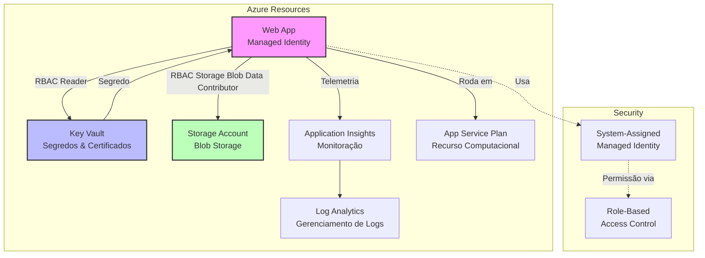

# 🚀 Infraestrutura de API na Azure com Bicep (IaC)


## 📋 Índice
- [Visão Geral](#-visão-geral)
- [Arquitetura](#️-arquitetura)
- [Estrutura do Projeto](#-estrutura-do-projeto)
- [Pré-requisitos](#-pré-requisitos)
- [Como Executar](#-como-executar)

## 🎯 Visão Geral

Este projeto implementa uma solução completa de **Infraestrutura como Código (IaC)** utilizando **Bicep** para provisionamento automatizado, modular e idempotente de toda infraestrutura necessária para suportar uma aplicação Web (API) na Microsoft Azure.

### Principais Características

- 🔐 **Passwordless Architecture**: Eliminação de segredos e credenciais estáticas
- 🎭 **Managed Identity**: Autenticação baseada em identidades gerenciadas
- 🛡️ **RBAC**: Controle de acesso granular baseado em funções
- 📊 **Observabilidade**: Monitoramento completo com Application Insights
- 🔄 **Idempotência**: Execução segura e repetível
- 📦 **Modularidade**: Componentes reutilizáveis e versionáveis

## 🏗️ Arquitetura



## 📁 Estrutura do Projeto

```
PROJETO-INFRA-PARA-API
├── main.bicep                  # Arquivo principal de orquestração
├── modules/                    # Módulos reutilizáveis
│   ├── applicationinsights.bicep   
│   ├── appserviceplan.bicep        
│   ├── keyvault.bicep              
│   ├── loganalytics.bicep          
│   ├── roleassignment.bicep        
│   ├── storage.bicep               
│   └── webapp.bicep                
└── parameters/                 # Parâmetros por ambiente
    ├── dev.bicepparam              
    └── prod.bicepparam             
```

### Detalhamento dos Módulos

| Módulo | Descrição | Recursos Provisionados |
|--------|-----------|----------------------|
| **applicationinsights.bicep** | Monitoramento e telemetria da aplicação | Application Insights, métricas customizadas |
| **appserviceplan.bicep** | Plano de hospedagem da aplicação | App Service Plan, scaling configurations |
| **keyvault.bicep** | Gerenciamento seguro de segredos | Key Vault, access policies |
| **loganalytics.bicep** | Centralização e análise de logs | Log Analytics Workspace |
| **roleassignment.bicep** | 🎯 Atribuições RBAC | Managed Identity role assignments |
| **storage.bicep** | Armazenamento de dados | Storage Account, containers |
| **webapp.bicep** | Hospedagem da aplicação | Web App, application settings |

### Descrição dos Arquivos

#### 📄 `main.bicep`
Arquivo principal que orquestra todo o deployment. Importa todos os módulos e define as dependências entre os recursos.

#### 📦 Módulos (`/modules/`)
Cada módulo é responsável por provisionar um recurso específico, seguindo o princípio de responsabilidade única:

- **applicationinsights.bicep**: Configura monitoramento e coleta de telemetria
- **appserviceplan.bicep**: Define a capacidade computacional (CPU, memória, scaling)
- **keyvault.bicep**: Gerencia segredos, certificados e chaves
- **loganalytics.bicep**: Centraliza logs para análise e troubleshooting
- **roleassignment.bicep**: Concede permissões via RBAC (evita duplicidade)
- **storage.bicep**: Provisiona armazenamento blob e filas
- **webapp.bicep**: Hospeda a aplicação com configurações de runtime

#### ⚙️ Parâmetros (`/parameters/`)
Arquivos de configuração específicos para cada ambiente:

- **dev.bicepparam**: Configurações para desenvolvimento (SKU menores, recursos limitados)
- **prod.bicepparam**: Configurações para produção (alta disponibilidade, scaling automático)

### Boas Práticas Aplicadas

- ✅ **Modularidade**: Cada recurso em um módulo separado
- ✅ **Reutilização**: Módulos podem ser usados em diferentes projetos
- ✅ **Separação de Configuração**: Parâmetros isolados por ambiente
- ✅ **Idempotência**: Execução segura e repetível
- ✅ **Versionamento**: Arquivos versionados no Git para rastreabilidade

## 🔧 Pré-requisitos

### Ferramentas Necessárias

| Ferramenta | Versão | Instalação |
|-----------|--------|------------|
| **Azure CLI** | ≥ 2.40.0 | [Download](https://docs.microsoft.com/en-us/cli/azure/install-azure-cli) |
| **Bicep CLI** | ≥ 0.22.0 | [Instalação](https://docs.microsoft.com/en-us/azure/azure-resource-manager/bicep/install) |
| **PowerShell** | ≥ 7.0 | [Download](https://docs.microsoft.com/en-us/powershell/scripting/install/installing-powershell) |
| **Visual Studio Code** | Latest | [Download](https://code.visualstudio.com/) |

### Extensões VS Code Recomendadas

| Extensão | ID | Descrição |
|----------|-----|-----------|
| **Bicep** | `ms-azuretools.vscode-bicep` | Syntax highlighting e validação Bicep |
| **Azure Account** | `ms-vscode.azure-account` | Gerenciamento de contas Azure |
| **Azure Resources** | `ms-azuretools.vscode-azureresourcegroups` | Visualização de recursos Azure |
| **PowerShell** | `ms-vscode.powershell` | Suporte a scripts PowerShell |

### Permissões Azure Necessárias

- ✅ `Contributor` no Subscription ou Resource Group
- ✅ `User Access Administrator` para RBAC assignments
- ✅ `Key Vault Administrator` para gerenciamento de segredos
- ✅ `Storage Account Contributor` para provisionamento de storage

### Verificação de Instalação

```bash
# Verificar Azure CLI
az --version

# Verificar Bicep CLI
az bicep version

# Verificar PowerShell
pwsh --version

# Verificar login no Azure
az account show
```

## 🚀 Como Executar

### Cenário 1: Ambiente de Desenvolvimento (DEV)

```bash
# 1. Login no Azure
az login

# 2. Criar Resource Group (se não existir)
az group create --name "rg-api-dev" --location "brazilsouth"

# 3. Validar o template
az bicep validate \
    --file main.bicep \
    --parameters "parameters/dev.bicepparam" \
    --resource-group "rg-api-dev"

# 4. Executar o deployment
az deployment group create \
    --resource-group "rg-api-dev" \
    --template-file main.bicep \
    --parameters "parameters/dev.bicepparam" \
    --mode Incremental
```
### Cenário 2: Ambiente de Produção (PROD)

```bash
# 1. Login no Azure
az login

# 2. Criar Resource Group (se não existir)
az group create --name "rg-api-prod" --location "brazilsouth"

# 3. Validar o template
az bicep validate \
    --file main.bicep \
    --parameters "parameters/prod.bicepparam" \
    --resource-group "rg-api-prod"

# 4. Executar o deployment
az deployment group create \
    --resource-group "rg-api-prod" \
    --template-file main.bicep \
    --parameters "parameters/prod.bicepparam" \
    --mode Incremental
```


